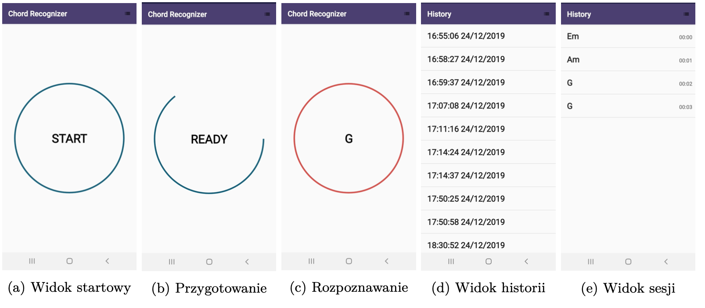

# Chord Recognizer

The project covers the classification of sound recordings using real-time convolutional neural networks for sound. For this project, the soundtracks will be one-second recordings of a six-string acoustic guitar chord in standard tuning. Recording of such tracks will be done using mobile devices. The aim of the project is to implement a mobile application that records the soundtrack and displays the name of the chord currently played by the user every second. Additionally, the app should record the results for each chord played and provide an easy way to review them.

